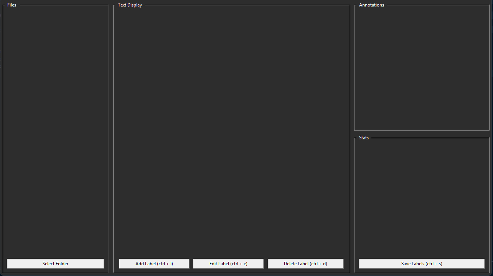
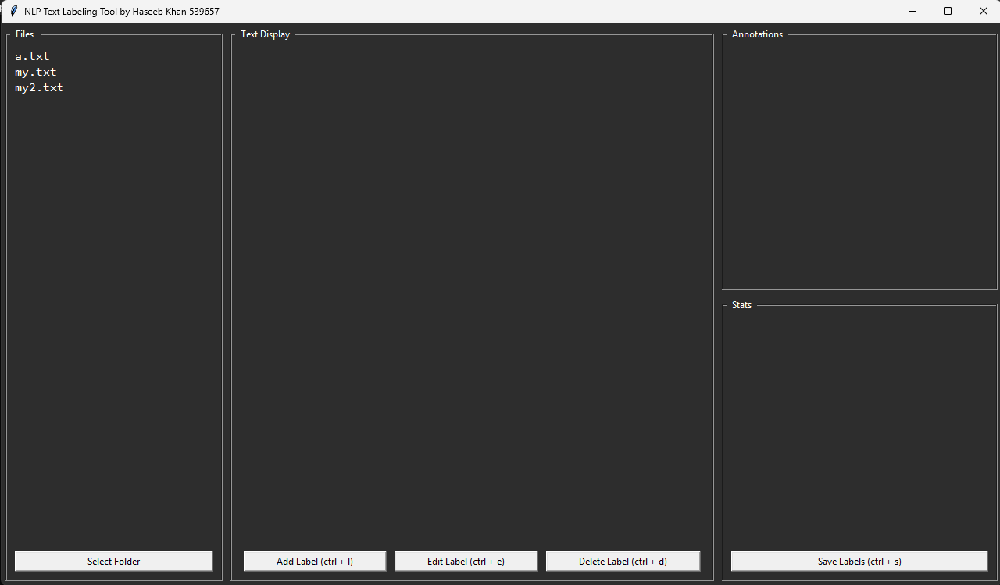
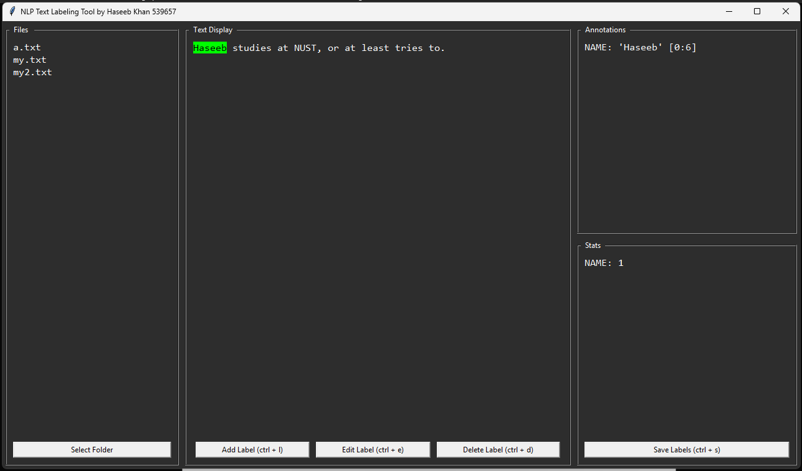
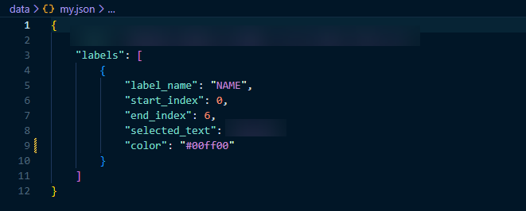

# NLP Text Labeling Tool

A desktop GUI application for annotating and labeling text files for NLP tasks (e.g., PERSON, LOCATION, POSITIVE). Labels are color-coded, highlighted directly in the text, and saved as JSON files alongside the original `.txt` files.

---

## Overview

Built with Python and Tkinter, this tool provides a lightweight, dependency-free interface for manual text annotation — a common step in preparing labeled datasets for NLP tasks like named entity recognition or sentiment classification. Annotations are stored in a structured JSON format with character-level start/end indices, making them straightforward to load into a downstream training pipeline.



---

## Setup

### Requirements

- Python 3.x with Tkinter (included in most standard Python installs)

### Dependencies

The tool uses only the Python standard library — no additional packages need to be installed:

- `tkinter` — GUI framework
- `os` — file and folder handling
- `json` — saving and loading label data

### Running the Tool

```bash
python main.py
```

---

## How to Use

### Loading Files

1. Click **Select Folder** in the left panel.
2. Pick any folder containing `.txt` files — they will appear in the file list automatically (sorted alphabetically).
3. Click a file in the list to load it into the text viewer.
4. If a matching `.json` file already exists in that folder, any previously saved labels will be restored automatically.



### Adding a Label

1. Select (highlight) a span of text in the text viewer using your mouse.
2. Click **Add Label** or press `Ctrl + L`.
3. Enter a label name in the dialog (e.g., PERSON, LOCATION). It will be converted to uppercase automatically.
4. Pick a color for the label highlight.
5. The selected text will be highlighted and the label will appear in the Annotations panel on the right.



### Editing a Label

1. Select a label in the Annotations panel on the right.
2. Click **Edit Label** or press `Ctrl + E`.
3. Change the label name and/or color as needed.
4. The text highlight and annotation list will update accordingly.

### Deleting a Label

1. Select a label in the Annotations panel on the right.
2. Click **Delete Label** or press `Ctrl + D`.
3. The highlight and annotation entry will be removed.

### Saving Labels

1. Click **Save Labels** or press `Ctrl + S`.
2. A `.json` file will be created (or overwritten) in the same folder as the `.txt` file, with the same name.
3. A confirmation dialog will appear when saving is complete.

---

## Keyboard Shortcuts

| Shortcut   | Action       |
| ---------- | ------------ |
| `Ctrl + L` | Add Label    |
| `Ctrl + E` | Edit Label   |
| `Ctrl + D` | Delete Label |
| `Ctrl + S` | Save Labels  |

---

## UI Layout

| Panel        | Location       | Purpose                                      |
| ------------ | -------------- | --------------------------------------------- |
| Files        | Left           | Lists `.txt` files from the selected folder  |
| Text Display | Center         | Shows the content of the selected file       |
| Annotations  | Right (top)    | Lists all labels applied to the current file |
| Stats        | Right (bottom) | Shows the count of each label type           |

---

## JSON Save Format

Each `.txt` file gets a matching `.json` file when labels are saved. The structure looks like this:



```json
{
  "text": "The full text content of the file...",
  "labels": [
    {
      "label_name": "PERSON",
      "start_index": 0,
      "end_index": 5,
      "selected_text": "Alice",
      "color": "#00ff00"
    }
  ]
}
```

- `start_index` and `end_index` are character positions in the text.
- `color` is stored as a hex color code.
- Labels are loaded back automatically when you open a file that has a matching `.json`.
